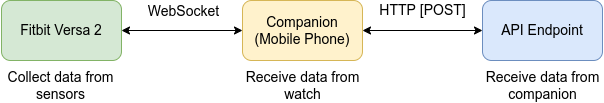

# Fitbit Versa 2 Real-Time Sensor Data Collector

The **Fitbit Versa 2 Real-Time Sensor Data Collector** is a compact and efficient application developed using the Fitbit SDK (version 4.0.0) specifically designed for the Fitbit Versa 2 smartwatch. This application harnesses the power of the device's built-in sensors to gather and present real-time sensor data.

## Key Features

1. **Sensor Data Collection:** The application utilizes the advanced sensors integrated into the Fitbit Versa 2, including the accelerometer, gyroscope, and heart rate monitor. These sensors provide accurate and up-to-date data about the user's physical activity and physiological measurements.

2. **Real-Time Monitoring:** The application offers a real-time monitoring experience, displaying dynamic sensor data as it's captured by the Versa 2's sensors. Users can instantly view changes in their movement, orientation, and heart rate, enhancing their awareness of their own activities.

3. **User-Friendly Interface:** The user interface of the application is designed to be intuitive and visually appealing. Sensor data is presented in a clear and comprehensible manner, allowing users to quickly understand and interpret their current metrics.

4. **Customizable Metrics:** Users have the flexibility to choose which sensor data they want to view on the main screen. Whether they're interested in tracking steps taken, heart rate fluctuations, or other metrics, the application allows customization to match individual preferences.

5. **Efficient Resource Utilization:** Built with efficiency in mind, the application maximizes battery life while delivering accurate and responsive real-time sensor data. The Fitbit Versa 2's resources are utilized optimally to ensure a seamless and responsive user experience.

6. **Data Insights:** The application goes beyond simple data display by providing insights into the collected sensor data. Users can gain valuable insights into their physical activities, sleep patterns, and overall well-being through the analysis and presentation of sensor data trends.

## Installation

Should the all the dependecies has in the `package.json` but just in case run this :

```bash
npm add --dev @fitbit/sdk@4.0.0
npm add --dev @fitbit/sdk-cli@1.7.0
```

To install the project, run the following commands :

```bash
npx fitbit-build generate-appid
npx fitbit-build
```

## How it works ?

<p align="center" style="margin: 50px 0">
    
<p>

- The device (Fitbit Versa 2 Watch) collects data from its sensors and sends it to the companion through WebSocket.
- The companion (Mobile phone) receives the data and send it to an API endpoint through an HTTP POST request.

## Sources

- The ``app` directory contains the sources corresponding to the application that will be deployed on the watch.
- The `companion` directory contains the sources corresponding to the application that will be deployed on the mobile phone (through the fitbit app).

## Development Stack

The application is built on the Fitbit SDK (version 4.0.0), which provides the necessary tools and resources to interact with the Fitbit Versa 2's sensors and develop seamless and engaging user experiences.

The "Fitbit Versa 2 Real-Time Sensor Data Collector" exemplifies innovation and usability, merging cutting-edge sensor technology with user-centered design principles to enhance the daily lives of Fitbit Versa 2 users.

## References

- [Fitbit SDK Website](https://dev.fitbit.com/)
- [Fitbit Device API](https://dev.fitbit.com/build/reference/device-api/)
- [Fitbit Companion API](https://dev.fitbit.com/build/reference/companion-api/)
